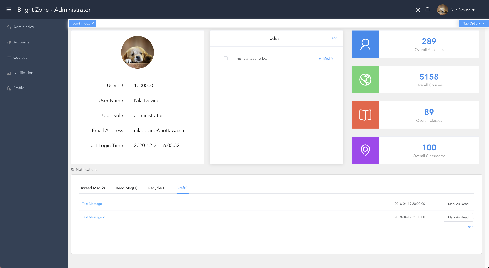
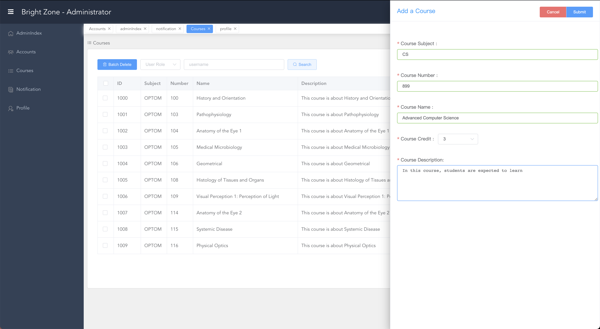
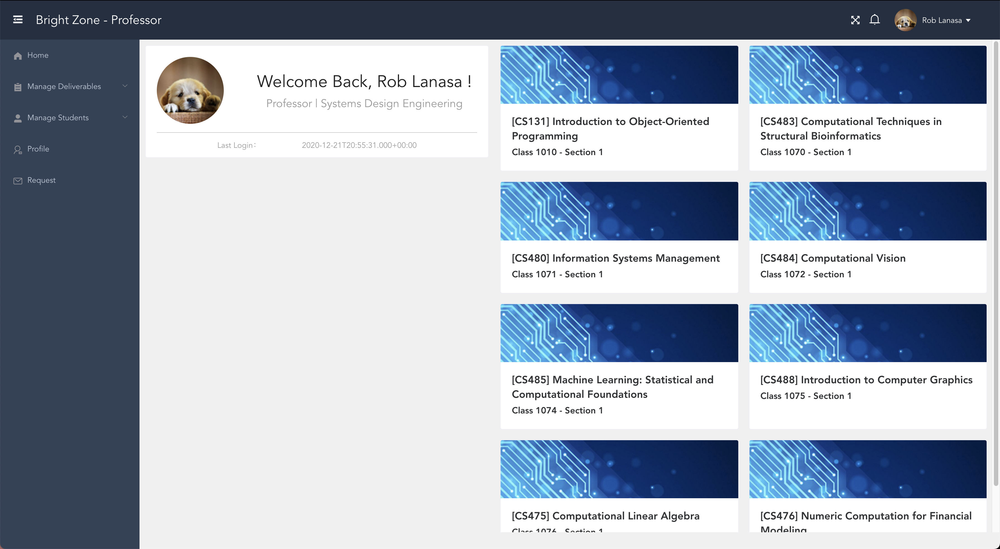
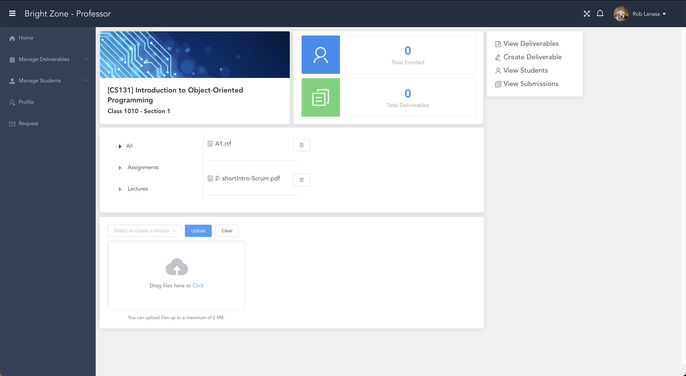
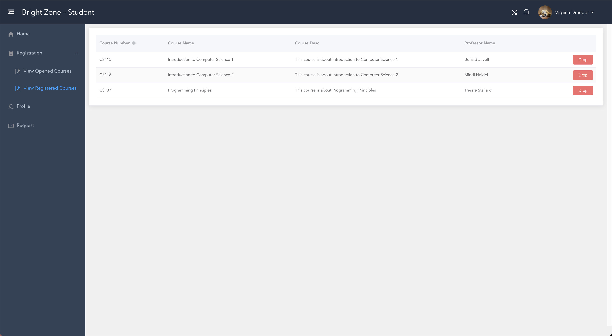

# Brightzone
[](http://badges.mit-license.org)
[](https://travis-ci.org/wallabag/android-app)
> Brightzone is an all-in-one university management system








## Features
- Complete user authentication protocol and user permission check
- Form inputs validation
- Cypress test coverage
## Requirements
- Vue.js 2.6.12
## Project setup
- Run ```npm install```
- For development, execute ```npm run serve``` then open ```https://localhost:8181```
- For production, execute ```npm run build``` then open ```https://localhost:8181```
- For Cypress tests, execute ```cypress open```
### Customize configuration
See [Configuration Reference](https://cli.vuejs.org/config/).

* This repo only contains the frontend source code. [Click](https://github.com/ruizi/BrightZone-Backend) to access the backend repo.


